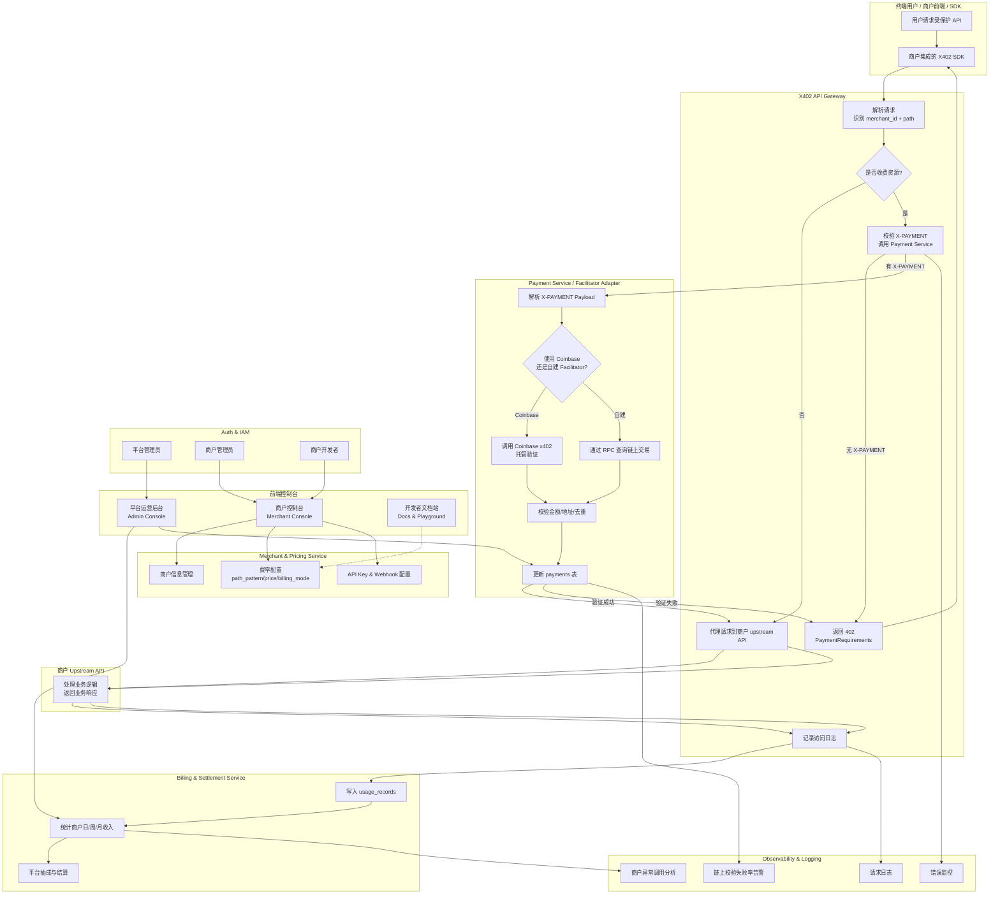

# X402 支付网关架构设计说明

## 1. 产品角色 & 使用场景

### 1.1 系统角色

• 平台方  
• 负责运行 x402 支付网关、结算逻辑、风控和后台管理。  
• B 端商户（Merchant）  
• 有自己的 API（数据、AI、量化信号、SaaS 服务）。  
• 在你的平台上开账号，配置“收费规则 + 回调”。  
• 集成你提供的 SDK（或直接调用你的网关 API）。  
• 终端用户（Merchant 的客户）  
• 使用商户的应用 / 前端。  
• 在使用受保护 API 时，走 x402 支付流程，用链上资产（比如 USDC）付费。  

---

## 2. 整体架构概览

### 2.1 高层结构（逻辑模块）

#### 后端：

1. API Gateway / x402 Gateway  
• 核心：拦截请求 → 判定是否付费 → 返回 402 → 校验支付 → 转发到商户后端。  

2. Merchant & Pricing Service（商户 & 费率服务）  
• 管理商户信息、计费策略、API Key、Webhook。  

3. Payment Service / Facilitator Adapter  
• 与 x402 Facilitator（Coinbase 或自建）交互，校验支付有效性。  

4. Billing & Settlement Service  
• 记录每次调用、费用、收入分成；生成报表。  

5. Admin / Console API  
• 提供给管理后台和 B 端控制台的 REST API。  

6. Auth & IAM  
• 支持平台管理员、商户管理员、商户开发者账号。  

7. Observability & Logging  
• 监控、日志、告警、审计。  

#### 前端：

1. B 端商户控制台（Merchant Console）  
• 商户注册、API Key 管理、费率配置、交易数据查看。  

2. 平台运营后台（Platform Admin）  
• 全局商户管理、费率模板、风控、统计数据。  

3. 开发者文档站（Docs + Playground）  
• SDK 使用说明、API 文档、调试工具。  

#### SDK：

• 提供给 B 端的客户端 SDK：  
• 自动处理 402 → 获取 PaymentRequirements → 调起钱包 / 支付 → 附带 X-PAYMENT 重试。  

---

## 3. 后端架构设计

### 3.1 服务划分（建议）

#### 3.1.1 API Gateway / x402 Gateway（Go）

职责：  
• 作为 商户 API 的反向代理：  
• 对外暴露统一网关域名（如 https://api.payx402.com/{merchant_id}/...）。  
• 决定请求是否需要付费（根据商户配置）。  
• 实现 x402 流程：  
• 首次请求：返回 402 Payment Required + PaymentRequirements JSON。  
• 带 X-PAYMENT header 的请求：调用 Payment Service 校验，然后转发。  
• 记录访问日志（调用次数、请求耗时、失败原因等）。  

关键点：  
• 支持多商户隔离：根据 merchant_id + path 区分不同商户及其配置。  
• 可以在 Nginx / Envoy 前面挂一层，或者它自己直接对外暴露。  

#### 3.1.2 Merchant & Pricing Service

职责：  
• 商户管理：  
• 商户注册 / 审核 / 状态（启用/禁用）。  
• 商户的回源地址（upstream API）配置。  
• 商户钱包地址 / 收款信息 / 分成比例。  
• 费率管理：  
• 按接口配置：  
• path_pattern（如 /api/signal/*）  
• price（例如 0.01 USDC / 请求）  
• billing_mode（按次 / 按请求包 / 按时间）  
• API Key：  
• 生成和管理商户的 merchant_api_key，用于 SDK / 后台调用。  

数据模型简化示例：  

```sql
merchants (
id,
name,
status,
upstream_base_url,
settlement_wallet,
created_at, updated_at
)

pricing_rules (
id,
merchant_id,
path_pattern,
price,
currency,
chain,
billing_mode,   -- PER_REQUEST / PER_TIME / ...
created_at, updated_at
)

api_keys (
id,
merchant_id,
key,
status,
created_at, updated_at
)
```

#### 3.1.3 Payment Service / Facilitator Adapter

职责：  
• 负责处理来自 Gateway 的支付验证请求：  
• 输入：X-PAYMENT payload + 预期费用（price, currency, chain, merchant_addr）。  
• 输出：支付是否有效 + 支付详情。  

实现方式：  
• v1 版本：对接 Coinbase x402 托管服务  
• 按他们的 API 规范转发支付校验请求。  
• 返回标准化结果给 Gateway。  
• v2 版本：自建 Facilitator  
• 通过 RPC 查链：  
• 交易是否成功；  
• 接收地址 == 商户地址；  
• 数额 >= 要求；  
• tx 未被重复使用。  
• 查询 & 更新 payments 表。  

数据模型：  

```sql
payments (
id,
merchant_id,
resource_path,
tx_hash,
payer_address,
merchant_address,
chain,
currency,
amount,
status,          -- PENDING / CONFIRMED / FAILED / REFUNDED
created_at,
confirmed_at
)
```

#### 3.1.4 Billing & Settlement Service

职责：  
• 存每次成功调用的计费记录：  
• 关联商户、具体接口、支付记录。  
• 生成统计：  
• 商户日/周/月收入；  
• API 调用数 / 收费请求数 / ARPU；  
• 平台总收入、分成比例。  

数据模型：  

```sql
usage_records (
id,
merchant_id,
pricing_rule_id,
payment_id,
request_id,
resource_path,
amount,
currency,
chain,
status,          -- CHARGED / FREE / FAILED
created_at
)
```

可以异步（通过消息队列）去写 usage，避免影响网关性能。  

#### 3.1.5 Admin / Console API

职责：  

为前端控制台提供统一 REST API：  
• 商户管理（创建、禁用、修改配置）。  
• 费率规则 CRUD。  
• 查询交易记录 / usage 统计。  
• 管理员登录、权限管理。  

建议使用 GraphQL 或 REST 都可以，Go / Node / NestJS 均可。  

---

## 4. 前端架构设计

你至少需要两个前端应用（可以是一个项目不同角色视图）：  

### 4.1 商户控制台（Merchant Console）

目标用户：B 端开发者 & 商户运营。  

主要页面：  
1. 登录 / 注册  
2. 总览（Dashboard）  
• 今日/昨日调用量  
• 收入情况  
• 失败率 & 响应时间  
3. API Key 管理  
• 生成 / 吊销 key  
4. 费率配置  
• 列表：所有 path pattern 的费率  
• 编辑：币种、价格、计费模式  
5. 路由配置  
• 商户的 upstream base URL  
• 测试路由  
6. 交易 & 收入明细  
• 每笔支付记录  
• 按时间、接口、链筛选  
7. Webhook 配置（可选）  
• 商户自己的系统接收“成功支付 / 调用事件”的回调  

技术栈建议：  
• React + TypeScript  
• UI 库：Ant Design / MUI  
• 状态管理：React Query / Zustand  
• 与 Console API 对接，统一使用 JWT / Session 登录。  

### 4.2 平台运营后台（Admin Console）

目标用户：你和你的团队。  

功能：  
• 所有商户列表 & 详情  
• 审核 / 禁用商户  
• 设置平台全局费率模板 / 收费策略（如平台抽成比例）  
• 所有支付记录、错误日志、风控报警  
• 手动调整账务（退款、修正）  

可以和商户控制台共用一套前端项目，通过角色权限控制展示不同菜单。  

### 4.3 开发者文档站（Docs）

不一定要单独项目，可以内嵌在控制台中：  
• x402 支付流程说明  
• SDK 使用示例（JS/TS、Python、Go）  
• 示例代码：怎样在一个 Node / Go 服务前接你的网关  

---

## 5. SDK 设计方案

### 5.1 核心职责

SDK 是给商户开发者用的，目标：  
• 屏蔽 x402 的细节；  
• 自动处理 402 → 支付 → 重试；  
• 提供简洁调用方式。  

### 5.2 典型使用方式（以 Node.js 为例）

```ts
import { X402Client } from "@yourorg/x402-sdk";

const client = new X402Client({
merchantId: "merchant_xxx",
apiKey: "xxx",
endpoint: "https://api.payx402.com",
walletProvider: myWalletProvider,  // or custom signer
});

async function callProtectedApi() {
const res = await client.request({
method: "GET",
path: "/signal/btc",
});
console.log(res.data);
}
```

### 5.3 SDK 内部逻辑

1. 发起请求 → 收到 402 + PaymentRequirements；  
2. 调起本地钱包 / 内置签名逻辑 → 向 facilitator 付款；  
3. 构造 X-PAYMENT header → 重试请求；  
4. 返回最终数据给业务代码。  

---

## 6. 核心调用链路示例

### 6.1 终端用户调用到商户 API（完整链）

1. 用户 → 商户前端 / 客户端  
2. 商户服务端调用你的 x402 Gateway（或前端直接请求 x402 Gateway）  
3. x402 Gateway 检查：该路径是否为收费资源？  
• 否 → 直接代理到商户 upstream API；  
• 是 → 检查是否带 X-PAYMENT。  
4. 没带 X-PAYMENT → 返回 402 + PaymentRequirements。  
5. 商户 SDK 收到 402 → 根据 PaymentRequirements 调用支付流程；  
6. 支付完成 → SDK 在 header 中加入 X-PAYMENT → 重试同一请求；  
7. Gateway 调用 Payment Service 验证支付 → 记录 payments & usage → 将请求代理到商户后端；  
8. 商户后端正常返回数据 → Gateway 原样返回给客户端，同时可在 header 加 X-PAYMENT-RESPONSE。  

---

## 7. 非功能性需求（NFR）

• 安全  
• 所有 API 强制 HTTPS；  
• 商户级限流（防止被薅）；  
• X-PAYMENT 只能用一次（防重放）；  
• DB 中敏感字段（API Key、地址）加密。  

• 多租户隔离  
• 所有数据按 merchant_id 分区；  
• 报表、权限、日志严格隔离。  

• 扩展性  
• 网关与后台 API 解耦，可水平扩展；  
• 支持多链、多币种，通过配置注入。  

• 监控 & 报警  
• QPS、错误率、链上查询失败率；  
• 异常支付 / 高频调用 IP；  
• 商户异常调用趋势。  

---

## 8. 系统详细架构图（Mermaid）


